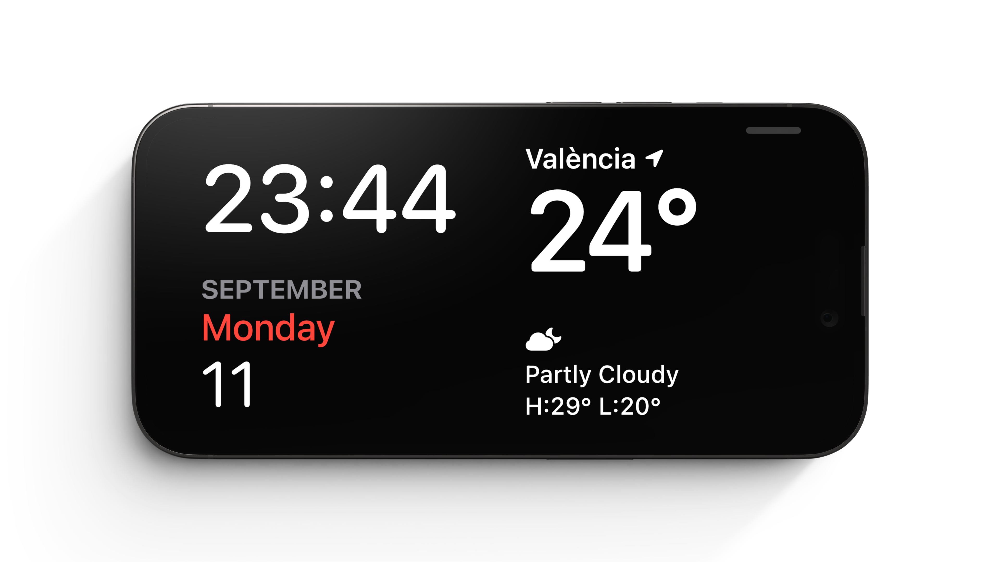

# Stand By Widget

A simple widget that displays the current time over the date (month, day of the week, day of the month). Designed to be used in Stand By mode on iOS 17.

Note: Tuist is required to generate the Xcode project. Currently, generating the project doesn't add the local packages so they need to be added manually. I'm looking into it.